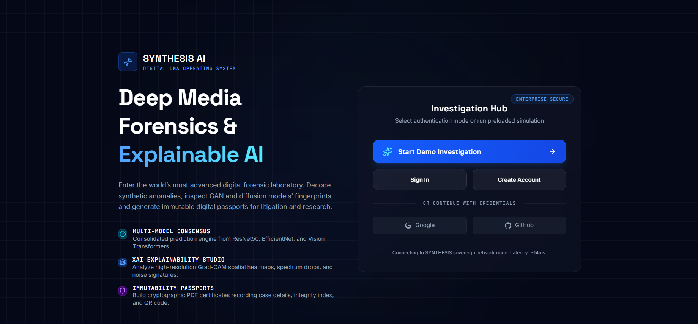
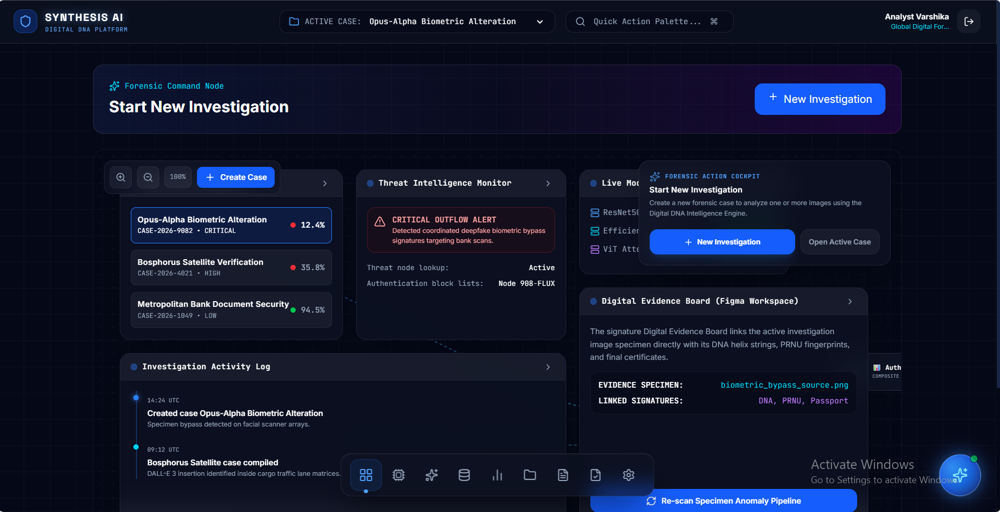

# 🛡️ Synthesis AI
### AI-Powered Digital Image Investigation Platform

> Detect AI-generated images using Deep Learning, explain every prediction with Grad-CAM, and generate professional forensic investigation reports.


---

# 📖 Overview

**Synthesis AI** is an AI-powered Digital Image Investigation Platform designed to detect AI-generated and manipulated images using Deep Learning.

The platform provides investigators with explainable AI predictions, Grad-CAM visualizations, automated forensic reports, downloadable PDF reports, and investigation history through an intuitive dashboard.

The project combines modern web technologies with computer vision to create an end-to-end digital forensic solution.

---

# 🚀 Live Demo

### 🌐 Frontend

https://synthesis-ai-hazel.vercel.app/

### 🎥 Demo Video

https://drive.google.com/file/d/1Wbmg9dL9gr9ZrzTcKxTIqI0g5mhynNvi/view?usp=sharing

---

# ✨ Features

- 🔐 JWT Authentication
- 👤 User Registration & Login
- 🖼️ Image Upload Investigation
- 🤖 AI Image Classification
- 📊 Confidence Score
- 🔥 Grad-CAM Explainability
- 📄 AI Investigation Report
- 📑 PDF Report Generation
- 📈 Investigation Dashboard
- 🕒 Investigation History
- 🗑️ Delete Investigation
- 📱 Responsive UI

---

# 🏗️ System Architecture

```text
                 React + TypeScript Frontend
                           │
                           ▼
                    FastAPI REST API
                           │
        ┌──────────────────┼─────────────────┐
        ▼                  ▼                 ▼
 Authentication      Investigation      Report Service
                           │
                           ▼
                    AI Prediction Engine
                           │
        ┌──────────────────┼─────────────────┐
        ▼                  ▼                 ▼
      CNN Model        Grad-CAM         Confidence
                           │
                           ▼
                  SQLite / PostgreSQL
```

---

# 🧠 AI Workflow

```text
Image Upload
      │
      ▼
Image Validation
      │
      ▼
CNN Prediction
      │
      ▼
Confidence Score
      │
      ▼
Grad-CAM Heatmap
      │
      ▼
AI Investigation Report
      │
      ▼
PDF Generation
```

---

# 🛠️ Tech Stack

## Frontend

- React
- TypeScript
- Tailwind CSS
- Vite

## Backend

- FastAPI
- SQLAlchemy
- Pydantic
- JWT Authentication

## AI / Machine Learning

- PyTorch
- OpenCV
- NumPy
- Grad-CAM

## Database

- SQLite
- PostgreSQL Ready

## Reporting

- ReportLab

---

# 📂 Project Structure

```text
Synthesis-AI
│
├── backend
│   ├── app
│   │   ├── api
│   │   ├── auth
│   │   ├── database
│   │   ├── ml
│   │   ├── models
│   │   ├── repositories
│   │   ├── services
│   │   ├── uploads
│   │   └── reports
│   │
│   ├── requirements.txt
│   └── main.py
│
├── frontend
│   ├── src
│   ├── public
│   └── package.json
│
└── README.md
```

---

# ⚙️ Backend Setup

```bash
git clone https://github.com/<your-username>/Synthesis-AI.git

cd backend

python -m venv venv

# Windows
venv\Scripts\activate

pip install -r requirements.txt

uvicorn app.main:app --reload
```

Backend

```
http://127.0.0.1:8000
```

Swagger

```
http://127.0.0.1:8000/docs
```

---

# 💻 Frontend Setup

```bash
cd frontend

npm install
```

Create `.env`

```env
VITE_API_URL=http://127.0.0.1:8000
```

Run

```bash
npm run dev
```

---

# 📄 API Endpoints

| Method | Endpoint | Description |
|---------|----------|-------------|
| POST | /auth/register | Register User |
| POST | /auth/login | Login |
| POST | /api/v1/investigation/upload | Upload Image |
| GET | /api/v1/investigation/history | Investigation History |
| GET | /api/v1/investigation/{id} | Investigation Details |
| GET | /api/v1/investigation/{id}/report | AI Report |
| GET | /api/v1/investigation/{id}/pdf | PDF Report |
| DELETE | /api/v1/investigation/{id} | Delete Investigation |

---

# 📷 Screenshots

## 🏠 Home Page


---

## 🔍 Investigation Dashboard


---


# 🎯 Future Improvements

- Deepfake Video Detection
- Multi-model Ensemble Prediction
- Batch Image Investigation
- Cloud Storage Integration
- Email Report Sharing
- Investigation Analytics Dashboard
- Explainable AI Improvements

---

# 👩‍💻 Author

**Varshika**

B.Tech – Artificial Intelligence & Machine Learning

GitHub:
https://github.com/<your-username>

LinkedIn:
https://linkedin.com/in/<your-profile>

---

# ⭐ Acknowledgements

Built using:

- FastAPI
- React
- PyTorch
- OpenCV
- ReportLab
- SQLAlchemy
- Grad-CAM

---

⭐ If you found this project useful, consider giving it a star!
